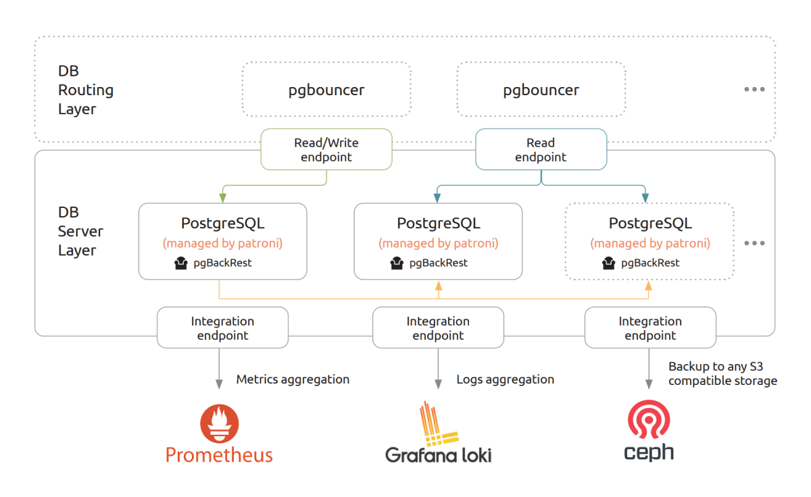

# Architecture

[PostgreSQL](https://www.postgresql.org/) is one of the most popular open source database. The “[Charmed PostgreSQL K8s](https://charmhub.io/postgresql-k8s)” is a Juju-based operator to deploy and support PostgreSQL from [day 0 to day 2](https://codilime.com/blog/day-0-day-1-day-2-the-software-lifecycle-in-the-cloud-age/), it is based on the [PostgreSQL Community Edition](https://www.postgresql.org/community/) using the [Patroni](https://github.com/zalando/patroni) to manage PostgreSQL cluster based on [PostgreSQL synchronous replication](https://patroni.readthedocs.io/en/latest/replication_modes.html#postgresql-synchronous-replication).



## Juju K8s concept

The charm design leverages the [sidecar](https://kubernetes.io/blog/2015/06/the-distributed-system-toolkit-patterns/#example-1-sidecar-containers) pattern to allow multiple containers in each pod with [Pebble](https://juju.is/docs/sdk/pebble) running as the workload container’s entrypoint.

Pebble is a lightweight, API-driven process supervisor that is responsible for configuring processes to run in a container and controlling those processes throughout the workload lifecycle.

Pebble `services` are configured through [layers](https://github.com/canonical/pebble#layer-specification), and the following containers represent each one a layer forming the effective Pebble configuration, or `pebble plan`:

* a charm container runs Juju operator code: `juju ssh postgresql-k8s/0 bash`
* a workload container runs the [PostgreSQL application](https://www.postgresql.org/) along with other services (like monitoring metrics exporters, etc): `juju ssh --container postgresql postgresql-k8s/0 bash`

As a result, if you run a `kubectl get pods` on a namespace named for the Juju model you’ve deployed the "Charmed PostgreSQL K8s" charm into, you’ll see something like the following:

```text
NAME                READY   STATUS    RESTARTS   AGE
postgresql-k8s-0    2/2     Running   0          65m
```

This shows there are 2 containers in the pod: `charm` and `workload` mentioned above.

And if you run `kubectl describe pod postgresql-k8s-0`, all the containers will have as Command `/charm/bin/pebble`. That’s because Pebble is responsible for the processes startup as explained above (see [troubleshooting](/reference/troubleshooting) for more details.).

## HLD (High Level Design)

The Charmed PostgreSQL K8s (`workload` container) based on `postgresql-image` resource defined in the [charm metadata.yaml](https://github.com/canonical/postgresql-k8s-operator/blob/main/metadata.yaml). It is an official Canonical [charmed-postgresql](https://github.com/canonical/charmed-postgresql-rock) [OCI/Rock](https://ubuntu.com/server/docs/rock-images/introduction) image, which is recursively based on the Canonical [`charmed-postgresql` snap].

[Charmcraft](https://juju.is/docs/sdk/install-charmcraft) uploads an image as a [charm resource](https://charmhub.io/postgresql-k8s/resources/postgresql-image) to [Charmhub](https://charmhub.io/postgresql-k8s) during the [publishing](https://github.com/canonical/postgresql-k8s-operator/blob/main/.github/workflows/release.yaml), as described in the [Juju SDK How-to guides](https://juju.is/docs/sdk/publishing).

The charm supports Juju deployment to all Kubernetes environments: [MicroK8s](https://microk8s.io/), [Charmed Kubernetes](https://ubuntu.com/kubernetes/charmed-k8s), [GKE](https://charmhub.io/postgresql-k8s/docs/h-deploy-gke), [Amazon EKS](https://aws.amazon.com/eks/), ...

The OCI/Rock ships the following components:

* PostgreSQL Community Edition (based on [`charmed-postgresql` snap]) 
* Patroni (based on [`charmed-postgresql` snap]) 
* PgBouncer (based on [`charmed-postgresql` snap]) 
* pgBackRest (based on [`charmed-postgresql` snap]) 
* Prometheus PostgreSQL Exporter (based on [`charmed-postgresql` snap]) 
* Prometheus PgBouncer Exporter (based on [`charmed-postgresql` snap]) 
* Prometheus Grafana dashboards and Loki alert rules are part of the charm revision (and missing in SNAP).

SNAP-based rock images guarantee the same components versions and functionality between VM and K8s charm flavours.

Pebble runs layers of all the currently enabled services, e.g. monitoring, backups, etc: 
```text
> juju ssh --container postgresql postgresql-k8s/0  /charm/bin/pebble services
Service            Startup   Current   Since
metrics_server     enabled   active    today at 21:42 UTC
pgbackrest server  disabled  inactive  -
postgresql         enabled   active    today at 21:42 UTC
```

The `postgresql` is a main Pebble service which is normally up and running right after the charm deployment.

All `metrics_server` Pebble service is activated after the relation with [COS Monitoring](/how-to/monitoring-cos/enable-monitoring) only.

> **:information_source: Note:** it is possible to star/stop/restart pebble services manually but it is NOT recommended to avoid a split brain with a charm state machine! Do it with a caution!!!

> **:warning: Important:** all pebble resources must be executed under the proper user (defined in  user:group options of pebble layer)!

The rock "charmed-postgresql" also ships list of tools used by charm:
* `psql` - PostgreSQL client to connect the database.
* `patronictl` - a tool to monitor/manage Patroni.
* `pgbackrest` - a framework to backup and restore PostgreSQL.

## Integrations

### PgBouncer

[PgBouncer](http://www.pgbouncer.org/) is a lightweight connection pooler for PostgreSQL that provides transparent routing between your application and back-end PostgreSQL Servers. The "[PgBouncer K8s](https://charmhub.io/pgbouncer-k8s)" is an independent charm "Charmed PostgreSQL K8s" can be related with.

### TLS Certificates Operator

[TLS Certificates](https://charmhub.io/tls-certificates-operator) charm responsible for distributing certificates through relationship. Certificates are provided by the operator through Juju configs. For the playground deployments, the [self-signed operator](https://charmhub.io/self-signed-certificates) is available as well.

### S3 Integrator

[S3 Integrator](https://charmhub.io/s3-integrator) is an integrator charm for providing S3 credentials to Charmed PostgreSQL which seek to access shared S3 data. Store the credentials centrally in the integrator charm and relate consumer charms as needed.

### Data Integrator

[Data Integrator](https://charmhub.io/data-integrator) charm is a solution to request DB credentials for non-native Juju applications. Not all applications implement a data_interfaces relation but allow setting credentials via config. Also, some of the applications are run outside of juju. This integrator charm allows receiving credentials which can be passed into application config directly without implementing juju-native relation.

### PostgreSQL Test App

The charm "[PostgreSQL Test App](https://charmhub.io/postgresql-test-app)" is a Canonical test application to validate the charm installation / functionality and perform the basic performance tests.

### GLAuth

GLAuth is a secure, easy-to-use and open-sourced LDAP server which provides capabilities to centrally manage accounts across infrastructures. The charm is available for Kubernetes clouds under the [GLAuth-K8s operator](https://charmhub.io/glauth-k8s) page.

### Grafana

Grafana is an open-source visualisation tools that allows to query, visualise, alert on, and visualise metrics from mixed data sources in configurable dashboards for observability. This charms is shipped with its own Grafana dashboard and supports integration with the [Grafana Operator](https://charmhub.io/grafana-k8s) to simplify observability. Please follow [COS Monitoring](/how-to/monitoring-cos/enable-monitoring) setup.

### Loki

Loki is an open-source fully-featured logging system. This charms is shipped with support for the [Loki Operator](https://charmhub.io/loki-k8s) to collect the generated logs. Please follow [COS Monitoring](/how-to/monitoring-cos/enable-monitoring) setup.

### Prometheus

Prometheus is an open-source systems monitoring and alerting toolkit with a dimensional data model, flexible query language, efficient time series database and modern alerting approach. This charm is shipped with a Prometheus exporters, alerts and support for integrating with the [Prometheus Operator](https://charmhub.io/prometheus-k8s) to automatically scrape the targets. Please follow [COS Monitoring](/how-to/monitoring-cos/enable-monitoring) setup.

## LLD (Low Level Design)

Please check the charm state machines displayed on [workflow diagrams](/explanation/flowcharts/charm). The low-level logic is mostly common for both VM and K8s charm flavours.

<!--- TODO: Describe all possible installations? Cross-model/controller? --->

### Juju Events

Accordingly to the [Juju SDK](https://juju.is/docs/sdk/event): “an event is a data structure that encapsulates part of the execution context of a charm”.

For this charm, the following events are observed:

1. [postgresql_pebble_ready](https://juju.is/docs/sdk/container-name-pebble-ready-event): informs charm about the availability of the rock "charmed-postgresql"-based `workload` K8s container. Also performs basic preparations to bootstrap the cluster on the first leader (or join the already configured cluster). 
2. [leader-elected](https://juju.is/docs/sdk/leader-elected-event): generate all the secrets to bootstrap the cluster.
5. [config_changed](https://juju.is/docs/sdk/config-changed-event): usually fired in response to a configuration change using the GUI or CLI. Create and set default cluster and cluster-set names in the peer relation databag (on the leader only).
6. [update-status](https://juju.is/docs/sdk/update-status-event): Takes care of workload health checks.
<!--- 7. database_storage_detaching: TODO: ops? event?
8. TODO: any other events? relation_joined/changed/created/broken
--->

### Charm Code Overview

The "[src/charm.py](https://github.com/canonical/postgresql-k8s-operator/blob/main/src/charm.py)" is the default entry point for a charm and has the `PostgresqlOperatorCharm` Python class which inherits from CharmBase.

CharmBase is the base class from which all Charms are formed, defined by [Ops](https://juju.is/docs/sdk/ops) (Python framework for developing charms). See more information in [Charm](https://juju.is/docs/sdk/constructs#charm).

The `__init__` method guarantees that the charm observes all events relevant to its operation and handles them.

The VM and K8s charm flavours shares the codebase via [charm libraries](https://juju.is/docs/sdk/libraries) in [lib/charms/postgresql_k8s/v0/](https://github.com/canonical/postgresql-k8s-operator/blob/main/lib/charms/postgresql_k8s/v0/postgresql.py) (of K8s flavour of the charm!):
```
> charmcraft list-lib postgresql-k8s                                                                                                                                                                                                               
Library name    API    Patch                                                                                                                                                                                                                          
postgresql      0      12                                                                                                                                                                                                                             
postgresql_tls  0      7                                  
```

<!--Links-->

[`charmed-postgresql` snap]: https://snapcraft.io/charmed-postgresql