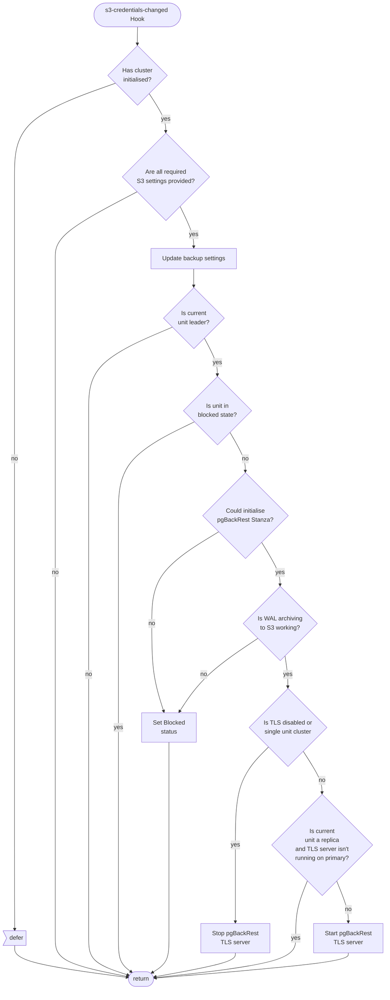
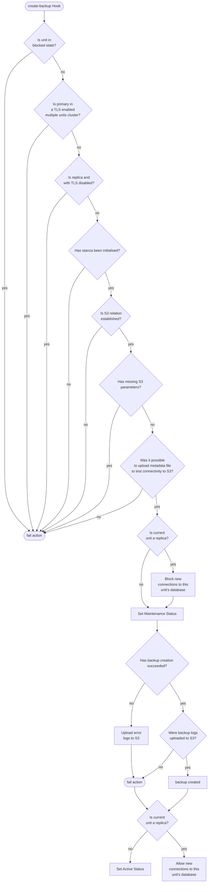
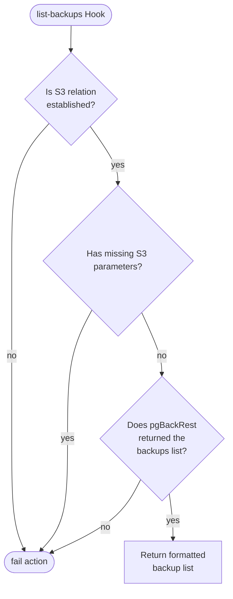
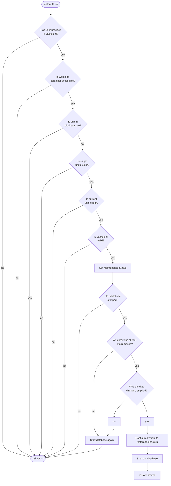

# Backup flowcharts
This document contains backups management flowchart, including all major hooks. This sources can be found at [src/backups.py](https://github.com/canonical/postgresql-k8s-operator/blob/main/src/backups.py).

## Hook Handler Flowcharts
These flowcharts detail the control flow of the hooks in this program. Unless otherwise stated, **a hook deferral is always followed by a return**.

## On S3 Credentials Changed Hook
[Click to navigate the mermaid diagram on GitHub](https://github.com/canonical/postgresql-k8s-operator/blob/main/docs/explanation/e-backups.md).

When certificates are received from TLS certificates operator through the `certificates` relation (or the relation is removed) the steps starting from `Is TLS disabled or single unit cluster` are also executed.

## On Create Backup Hook
[Click to navigate the mermaid diagram on GitHub](https://github.com/canonical/postgresql-k8s-operator/blob/main/docs/explanation/e-backups.md).

## On List Backups Hook
[Click to navigate the mermaid diagram on GitHub](https://github.com/canonical/postgresql-k8s-operator/blob/main/docs/explanation/e-backups.md).

## On Restore Hook
[Click to navigate the mermaid diagram on GitHub](https://github.com/canonical/postgresql-k8s-operator/blob/main/docs/explanation/e-backups.md).

The unit status becomes `Active` or `Blocked` after a, respectively, successful or failed restore
is detected in the update status hook.
