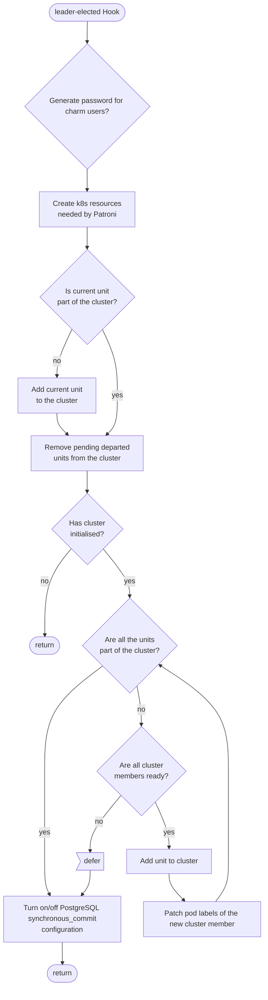
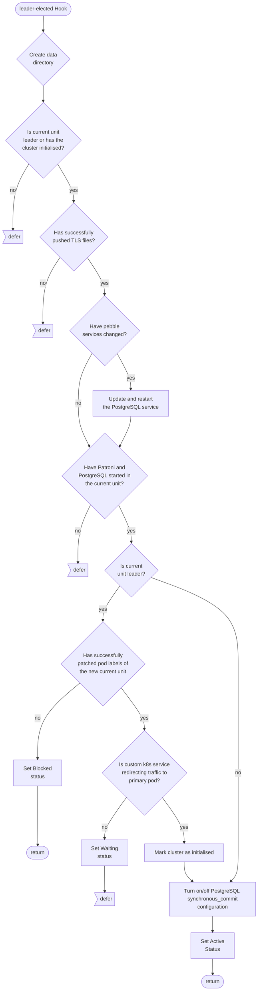

# Charm flowcharts

The file `charm.py` is the entrypoint for the charm. It contains functions for its basic operation, including its major hooks and file management. This file can be found at [src/charm.py](https://github.com/canonical/postgresql-k8s-operator/blob/main/src/charm.py).

## Hook Handler Flowcharts

These flowcharts detail the control flow of the hooks in this program. Unless otherwise stated, **a hook deferral is always followed by a return**.

## Leader Elected Hook
[Click to navigate the mermaid diagram on GitHub](https://github.com/canonical/postgresql-k8s-operator/blob/main/docs/explanation/e-charm.md).

## PostgreSQL Pebble Ready Hook
[Click to navigate the mermaid diagram on GitHub](https://github.com/canonical/postgresql-k8s-operator/blob/main/docs/explanation/e-charm.md).

