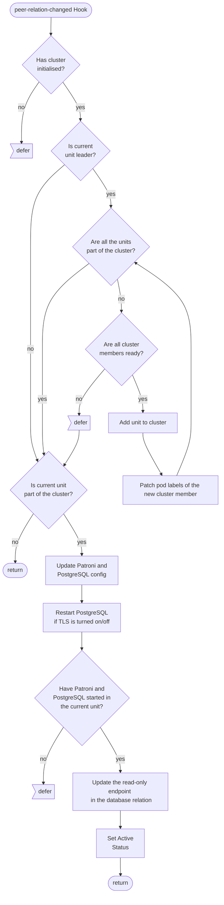
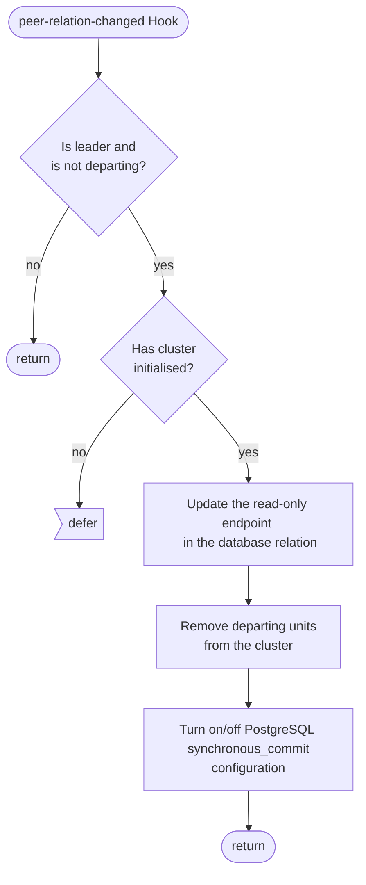

# Relations flowcharts

This reference documentation details the implementation of the `database-peers` peer relation. This is the peer relation for PostgreSQL, used to share user and config information from the leader unit to the follower units. The file implementing these relations can be found here: [src/relations/charm.py](https://github.com/canonical/postgresql-k8s-operator/blob/main/src/charm.py) (it should be moved to a file called `src/relations/peers.py` in the future).

## Expected Interface

These are the expected contents of the databags in this relation (all values are examples, generated in a running test instance):

## Hook Handler Flowcharts

These flowcharts detail the control flow of the hooks in this program. Unless otherwise stated, **a hook deferral is always followed by a return**.

## Peer Relation Changed Hook
[Click to navigate the mermaid diagram on GitHub](https://github.com/canonical/postgresql-k8s-operator/blob/main/docs/explanation/e-peers.md).

## Peer Relation Departed Hook
[Click to navigate the mermaid diagram on GitHub](https://github.com/canonical/postgresql-k8s-operator/blob/main/docs/explanation/e-peers.md).

