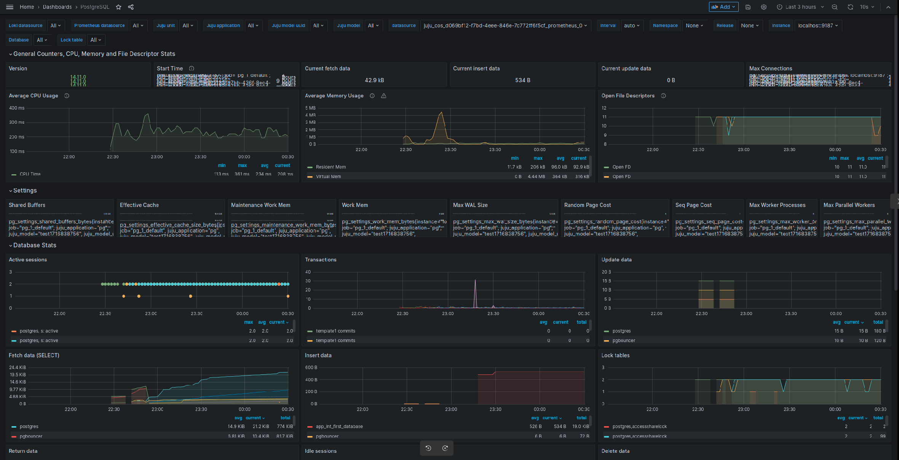

# How to enable monitoring (COS)

## Prerequisites

* [`cos-lite` bundle](https://charmhub.io/topics/canonical-observability-stack/tutorials/install-microk8s) deployed in a Kubernetes environment

## Offer interfaces via the COS controller

First, we will switch to the COS K8s environment and offer COS interfaces to be cross-model integrated with the Charmed PostgreSQL K8s model.

To switch to the Kubernetes controller for the COS model, run
```text
juju switch <k8s_cos_controller>:<cos_model_name>
```

To offer the COS interfaces, run 

```text
juju offer grafana:grafana-dashboard
juju offer loki:logging
juju offer prometheus:receive-remote-write
```

## Consume offers via the PostgreSQL model

Next, we will switch to the Charmed PostgreSQL K8s model, find offers, and consume them.

We are currently on the Kubernetes controller for the COS model. To switch to the PostgreSQL model, run

```text
juju switch <k8s_db_controller>:<postgresql_model_name>
```

To find offers, run the following command (make sure not to miss the ":" at the end!):
```text
juju find-offers <k8s_cos_controller>: 
```

The output should be similar to the sample below, where `k8s` is the k8s controller name and `cos` is the model where `cos-lite` has been deployed:
```text
Store  URL                    Access  Interfaces
k8s    admin/cos:grafana      admin   grafana:grafana-dashboard
k8s    admin/cos.loki         admin   loki:logging
k8s    admin/cos.prometheus   admin   prometheus:receive-remote-write
...
```

To consume offers to be reachable in the current model, run

```text
juju consume <k8s_cos_controller>:admin/cos.grafana
juju consume <k8s_cos_controller>:admin/cos.loki
juju consume <k8s_cos_controller>:admin/cos.prometheus
```
## Deploy and integrate Grafana

First, deploy [`grafana-agent-k8s`](https://charmhub.io/grafana-agent-k8s):

```text
juju deploy grafana-agent-k8s --trust
```

Then, integrate (previously known as "[relate](https://documentation.ubuntu.com/juju/3.6/reference/relation/)") it with Charmed PostgreSQL K8s:

```text
juju integrate grafana-agent-k8s grafana
juju integrate grafana-agent-k8s loki
juju integrate grafana-agent-k8s prometheus
```
Finally, integrate `grafana-agent-k8s` with consumed COS offers:
```text
juju integrate grafana-agent-k8s postgresql-k8s:grafana-dashboard
juju integrate grafana-agent-k8s postgresql-k8s:logging
juju integrate grafana-agent-k8s postgresql-k8s:metrics-endpoint
```

After this is complete, Grafana will show the new dashboard `PostgreSQL Exporter`  and will allow access to Charmed PostgreSQL logs on Loki.

### Sample outputs

Below is a sample output of `juju status` on the Charmed PostgreSQL K8s model:

```text
Model    Controller  Cloud/Region        Version  SLA          Timestamp
welcome  microk8s    microk8s/localhost  3.1.6    unsupported  00:21:41+02:00

SAAS        Status  Store     URL
grafana     active  microk8s  admin/cos.grafana
loki        active  microk8s  admin/cos.loki
prometheus  active  microk8s  admin/cos.prometheus

App                Version  Status  Scale  Charm              Channel  Rev  Address         Exposed  Message
grafana-agent-k8s  0.32.1   active      1  grafana-agent-k8s  stable    42  10.152.183.61   no       
postgresql-k8s     14.9     active      3  postgresql-k8s     14/edge  145  10.152.183.126  no       

Unit                  Workload  Agent   Address       Ports  Message
grafana-agent-k8s/0*  active    idle    10.1.142.191         
postgresql-k8s/0      active    idle    10.1.142.171         
postgresql-k8s/1      active    idle    10.1.142.169         
postgresql-k8s/2*     active    idle    10.1.142.170         Primary

```

Below is a sample output of `juju status` on COS K8s model:

```text
Model  Controller  Cloud/Region        Version  SLA          Timestamp
cos    microk8s    microk8s/localhost  3.1.6    unsupported  00:21:19+02:00

App           Version  Status  Scale  Charm             Channel  Rev  Address         Exposed  Message
alertmanager  0.25.0   active      1  alertmanager-k8s  edge      91  10.152.183.215  no       
catalogue              active      1  catalogue-k8s     edge      27  10.152.183.187  no       
grafana       9.2.1    active      1  grafana-k8s       edge      92  10.152.183.95   no       
loki          2.7.4    active      1  loki-k8s          edge      99  10.152.183.28   no       
prometheus    2.46.0   active      1  prometheus-k8s    edge     149  10.152.183.232  no       
traefik       2.10.4   active      1  traefik-k8s       edge     155  10.76.203.228   no       

Unit             Workload  Agent  Address       Ports  Message
alertmanager/0*  active    idle   10.1.142.186         
catalogue/0*     active    idle   10.1.142.176         
grafana/0*       active    idle   10.1.142.189         
loki/0*          active    idle   10.1.142.187         
prometheus/0*    active    idle   10.1.142.188         
traefik/0*       active    idle   10.1.142.185         

Offer       Application  Charm           Rev  Connected  Endpoint              Interface                Role
grafana     grafana      grafana-k8s     92   1/1        grafana-dashboard     grafana_dashboard        requirer
loki        loki         loki-k8s        99   1/1        logging               loki_push_api            provider
prometheus  prometheus   prometheus-k8s  149  1/1        receive-remote-write  prometheus_remote_write  provider

```
### Connect Grafana web interface

To connect to the Grafana web interface, follow the [Browse dashboards](https://charmhub.io/topics/canonical-observability-stack/tutorials/install-microk8s) section of the MicroK8s "Getting started" guide.

```text
juju run grafana/leader get-admin-password --model <k8s_cos_controller>:<cos_model_name>
```

Below is a sample screenshot of Charmed PostgreSQL on the Grafana web UI:



