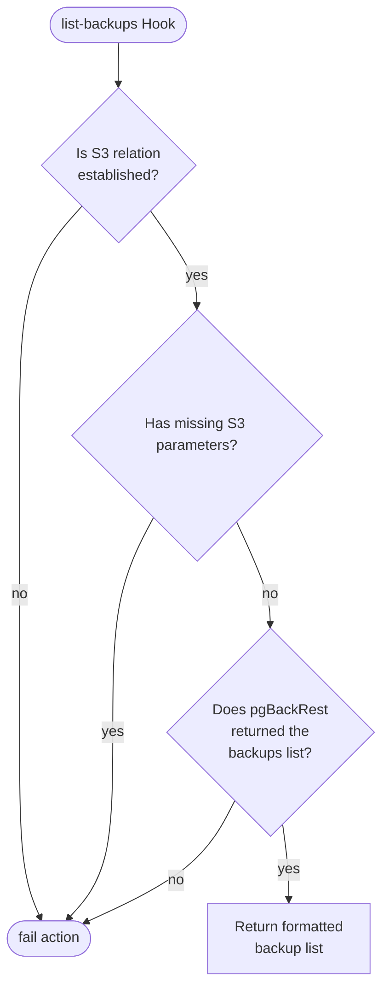
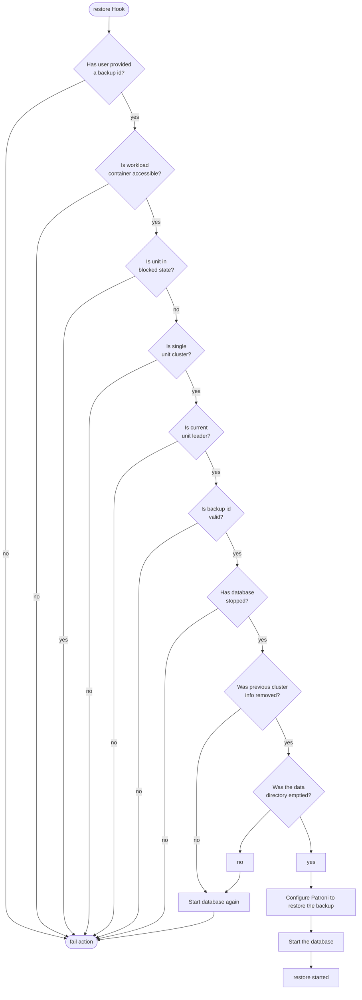

# Backups.py Reference Documentation

This file contains functions for related to backups management, including its major hooks. This file can be found at [src/backpus.py](../../../src/backups.py).

## Hook Handler Flowcharts

These flowcharts detail the control flow of the hooks in this program. Unless otherwise stated, **a hook deferral is always followed by a return**.

### On S3 Credentials Changed Hook


### On Create Backup Hook

```mermaid
flowchart TD
  hook_fired([create-backup Hook]) --> 
```

### On List Backups Hook



### On Restore Hook


