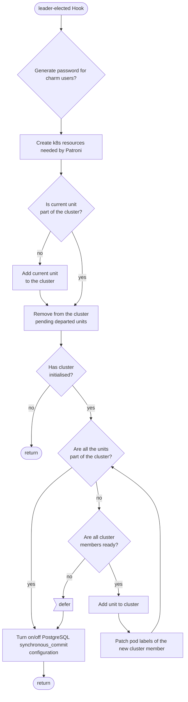

# Charm.py Reference Documentation

This file is the entrypoint for the charm, and contains functions for its basic operation, including its major hooks and file management. This file can be found at [src/charm.py](../../../src/charm.py).

## Hook Handler Flowcharts

These flowcharts detail the control flow of the hooks in this program. Unless otherwise stated, **a hook deferral is always followed by a return**.

### Leader Elected Hook

### PostgreSQL Pebble Ready Hook

